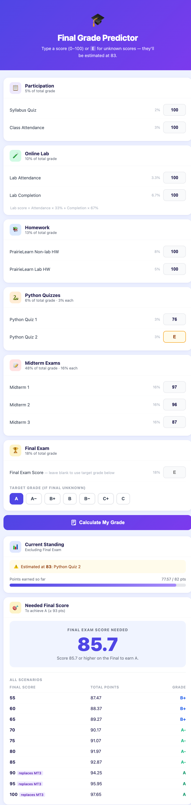

# Grade Predictor

A web-based grade calculator that parses any course syllabus (PDF or text) using the Gemini AI API and lets you track your scores, simulate final exam scenarios, and see exactly what grade you need to hit your target.



## Features

- **AI Syllabus Parser** — Upload a PDF or paste notes; Gemini extracts all grading components, weights, and replacement policies automatically
- **Multi-course Sidebar** — Manage multiple courses at once, each with its own grading breakdown
- **Final Exam Simulator** — See your projected grade for different final exam scores (e.g. 60 / 75 / 90)
- **Target Grade Calculator** — Tells you the exact final exam score needed to reach each letter grade (A, A−, B+, …)
- **Midterm Replacement Rule** — Automatically handles policies where the final exam replaces the lowest midterm if it's higher
- **CLI Version** — `grade_predictor.py` is a standalone terminal version hardcoded for a specific course rubric

## Project Structure

```
├── grade_predictor.html   # Single-file frontend (no build step required)
├── grade_predictor.py     # CLI version (standalone Python script)
└── backend/
    ├── main.py            # FastAPI backend — syllabus parsing via Gemini API
    └── requirements.txt   # Python dependencies
```

## Getting Started

### Backend

```bash
cd backend
pip install -r requirements.txt
```

Create a `.env` file in the `backend/` directory:

```
GEMINI_API_KEY=your_gemini_api_key_here
```

Start the server:

```bash
uvicorn main:app --reload
```

The API will be available at `http://localhost:8000`.

### Frontend

Open `grade_predictor.html` directly in your browser — no build step needed.

Make sure the backend is running at `http://localhost:8000` before uploading a syllabus.

### CLI Version (Optional)

```bash
python grade_predictor.py
```

Follow the prompts to enter your scores. This version is hardcoded for a specific course rubric (Syllabus Quiz 2%, Attendance 3%, Lab 10%, PrairieLearn HW 8%, PrairieLearn Lab HW 5%, Python Quizzes 6%, three Midterms 16% each, Final 18%).

## API

### `POST /analyze`

Parses a syllabus and returns a structured grading schema.

| Field | Type | Description |
|---|---|---|
| `file` | `File` (optional) | PDF or TXT syllabus file |
| `notes` | `string` (optional) | Free-text grading notes |

At least one of `file` or `notes` must be provided.

**Response:** JSON object with `course_name`, `components`, `replacement_policy`, `grade_thresholds`, and `notes`.

### `GET /health`

Returns `{"status": "ok"}`.

## Tech Stack

- **Frontend:** Vanilla HTML/CSS/JS (single file, no framework)
- **Backend:** FastAPI + Google Gemini 2.5 Flash Lite
- **PDF Parsing:** pypdf
